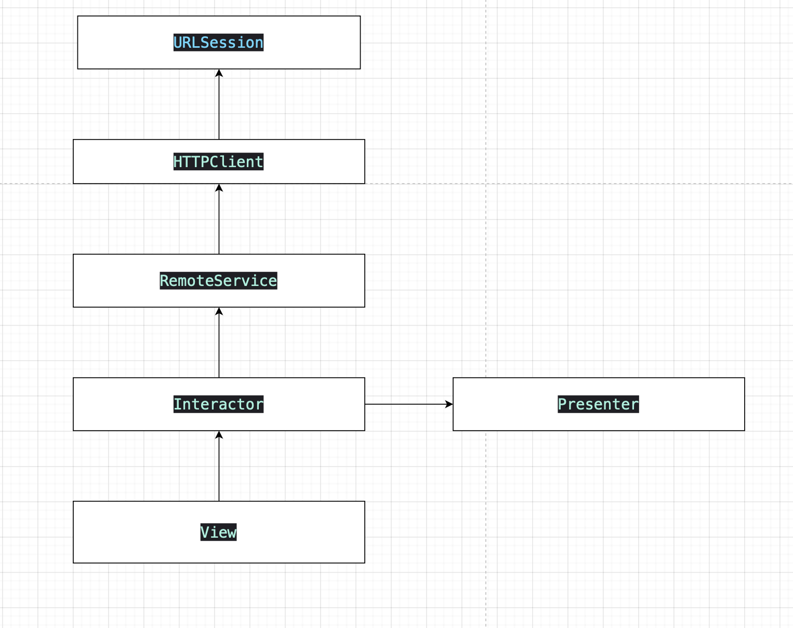

# iOS Challenge

## Goal

The goal of this project was to create an app that access an API and show information about the weather

## Project minimum requirements:

- MacOS Ventura 13.1 +
- iOS 16
- Swift 5
- XCode 14

the project doest not have any 3rd libs, just open the .project on xcode :) 

The Project Architecture is based on Clean Arch concepts. 

These are the main layers of our project:

ClientHTTP: responsible to make http requests using URL Session. 

RemoteService: responsible to handle the ClientHTTP results and map the data result into a struct model. 

Interactor: Responsible for business logic, he talks to the RemoteService to get the weather data and ask to the presenter to present the received data. 

Presenter: Responsible for presentation logic. Prepare the data to be presented in the View. 

View: responsible for handling UIKit logic. Shows the received formatted data from the Presenter.

RemoteService: responsible comunicate with network/core service
 
Factory: is the entry point of the Detail Scene. Responsible to instantiate the UIViewController and inject all the module dependencies.  

Why do we choose that architecture? 

The goal here is to show an way to build an escalable project. Since is very easy to have classes with a lot responsabilites, things can get complicated a long the way if we not start right. 

we can easly change things on the network layer, like start to using an lib like Alamofire or Moya, without breaking ou r business logic or the UI. 

we can also easly change our UI without any impact on the other layers, would be pretty simple to build that screen with SwiftUI for example, withou breaking the other modules.

each layer use protocols to talk to another, so it's pretty simple to test them in isolation. 

## Observations 

The weather screen is 100% viewcoded.

## Unit Tests

We Build Unit tests for the ClientHTTP, RemoteService e Interactor. Each layer was tested isolated, that means their dependencies were all mocked, so we can have fast and reliable tests.     

 
